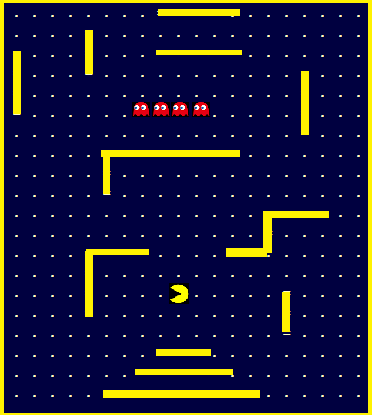

#(Basic) Pacman game design
## #Problem Statement
Design a basic Pacman game in C++
## #Solution
### Components
1. Map (board)
2. Pacman
3. Ghosts (toxins)
4. Walls
5. Cookies

### Assumptions
- Pacman has configurable _life_; default is 3 assumed
- Both Pacman and Ghosts have common property of movement; however, Ghosts can move by themselves, whereas Pcman is controlled by user key-press
- Both Pacman and Ghosts can move 1 step at a time, either _left_, _right_, _up_ and _down_
- If Pacman eats cookies, score count will increment. If no cookies in the path no points.
- At a time (Tx), if Ghosts and Pacman are at same position (x,y) of map, it will be considered as _death_ of Pacman; which inturn will take 1 _life_ from Pacman account
- On _death_ of Pacman, only Pacman will position will be reset to default location (starting point), and all other components status will be unaltered.
- Both _Pacman_ and _Ghosts_ cannot move through the _Wall_.
- Game can have different Levels and in each level user cross he/she might encounter with different Level of challenges. 

### Design
**Map**
I will have _Map_ as an _Array of characters_.
`char map[20][20];`
**Components**
Components inside the _Map_ can be either _Moving_ (Pacman and Ghosts) or _Non-Moving_ (Cookies and Wall). And they can be respresented by special _characters_:
- Pacman as **@**
- Ghosts as **#**
- Cookies as **.**
- Walls as **=**

So basic _Map_ of 20x20 array may look like this:
`char map[20][20] = {`
`{........====........},`

`{....=...............},`

`{=...=...=====.......},`

`{=...=...........=...},`

`{=...............=...},`

`{=......####.....=...},`

`{................=...},`

`{.....========.......},`

`{.....=..............},`

`{.....=..............},`

`{..............====..},`

`{..............=.....},`

`{....====....==......},`

`{....=...............},`

`{....=....@.....=....},`

`{....=..........=....},`

`{...............=....},`

`{........===.........},`

`{.......=====........},`

`{.....=========......}`

`};`

For better understanding purpose, I have drawn an image representation of above Map:

Movement of _Ghosts_ are time driven, which in-turn determine their speed. Speed of a _Ghost_ is that component, which will increase with Level of the game.

Position of the Wall might change as Level of the game changes.

**Class Diagram**
Below is the class diagram and their relationsship:

**Operation Concurrancy**
To achieve concurrancy in my design, I will be using 4 C++ threads:

**_Thread1_**:
`main()` thread itself. 
Operations will involve:
- Creating components and initializing their values
- Drawing the Map during initialization
- Resetting the Component's position inside Map
- Invoking other 3 child threads
- And help to `join()` back child threads

**_Thread2_**:
`keypress()` This thread will receive your input from key-board and help to decode the Pacman movement as _left()_, _right()_, _up()_ or _down()_.
_Note_: In case of C++, we have no support to receive inputs of arrow-keys from key-board. So I will be using `getch()` from C programming defined under `<conio.h>` to fullfil my requirements.

**_Thread3_**:
`game_controller()` This thread will monitor few operations:
- Monitor _Ghost_ and _Pacman_ current position at a given time (Tx)
- Updates `score` in score board
- Update _Pacman_ life and reset its position to initial value if it touches _Ghosts_
- Update `Map` if _Pacman_ eats cookie in his current position
- And, `redraw()` the Map on `stdout()` for user to display

**_Thread4_**:
`automove_ghosts()` This thread will help move 4 Ghosts one step at a time. These movements are time based operations and Ghosts can move either _left()_, _right()_, _up()_ or _down()_ at a given time, depending on their speed.